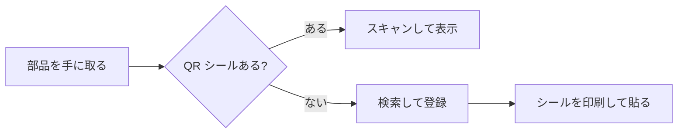
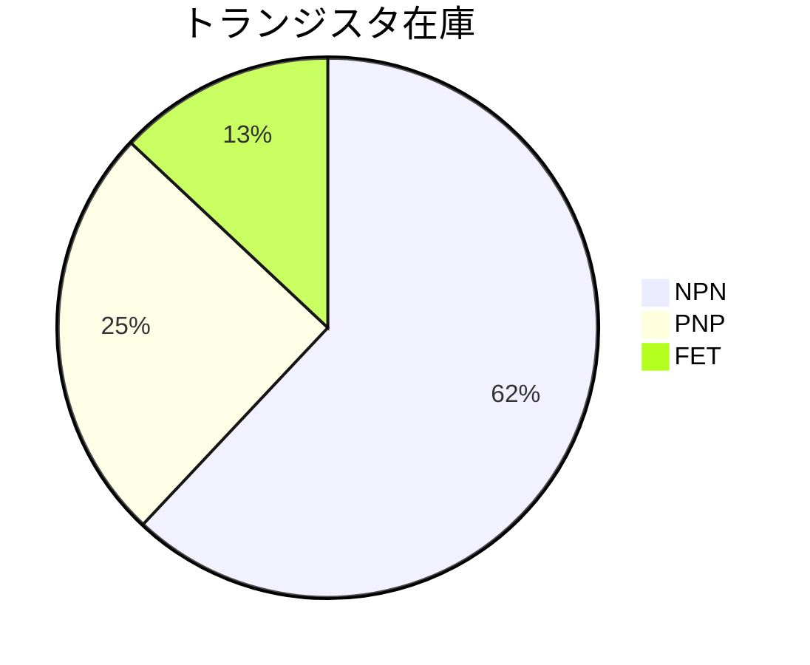

# デモシード計画 (ショーケース・種・timer)

qr-demo.tommie.jp は稼働済みだが中身が空で、再シード timer も止めている。
この doc は docs/39 §6-1 と §8 を実行に落とした正本 — ①ショーケース
ノートの作り込み → ②種 (qr_seed) の作成 → ③timer 有効化、の 3 段階。

**順番厳守**。種を撮る前に timer やリセットの手動テストを回すと、
作り込んだノートが消える (timer は種が無ければ落ちるだけだが、
撮った直後の手動テストは §4 の手順どおり「撮ってから」行う)。

## 1. 前提と注意

- 作業はすべて <https://qr-demo.tommie.jp> に demo / demo で
  ログインして行う。**書き始める前に amber の DEMO バッジとバナーを
  目視すること** — 本番 (qr.tommie.jp) に書いてしまう事故の防止
- ノート番号 1〜9 は URL 直打ちで作る:
  `/item/1` を開く → 未登録の案内が出る → メモを書いて「更新」。
  「+」は使わない (1000 以上を採番するため番号が揃わない)
- アップロードは 1 ファイル **2MB まで** (デモの上限)。音声・PDF は
  小さいものを用意する
- 記法の正本は docs/メモ記法.md (画面の「記法」リンクからも見える)
- 所要 30〜60 分。途中で中断しても害はない (timer はまだ動いていない)

## 2. ショーケースノートの構成 (9 枚)

| # | ノート | 見せる機能 |
| --- | --- | --- |
| 1 | 案内 | デモの歩き方・検索例・サンプル QR |
| 2〜4 | BJT 部品 ×3 | タグ・プロパティ (特性表)・NOT 検索 |
| 5 | 数式 | KaTeX |
| 6 | 回路図 | CircuiTikZ |
| 7 | 図表 | mermaid |
| 8 | お絵かき | 手描き図 + 画像の幅記法 |
| 9 | 音声・PDF | 添付の再生・閲覧 |

検索プレイグラウンドは独立ノートにせず #1 案内に載せる (タグは
本文中でクリックできるので、案内がそのまま試す入口になる)。

### 2-1. #1 案内ノート

サンプル QR (§2-8) を後で貼るので、本文は最後にもう一度触る。

```text
# QR search デモへようこそ #デモ

電子部品を QR シールで管理するノートアプリのデモです。
データは毎時 0 分に初期状態へ戻ります。ご自由にお試しください。

## 試すこと
- 本文のタグを押す: #bjt → 部品が特性表つきで並ぶ
- 検索窓に `#bjt !(#pnp)` → NPN だけに絞る (NOT 検索)
- `hFE` や `東芝` などの語でも全文検索できる
- 2 番のノートの「QR」ボタン → シール印刷画面
- 下の QR を自分のスマホで読む → このデモに飛ぶ
- 「+」で新しいノートを作って自由に書く

## 各ノートの見どころ
2〜4: 部品ノート / 5: 数式 / 6: 回路図 / 7: 図表 /
8: お絵かき / 9: 音声と PDF

書き方の説明: [メモ記法](/docs/memo)
```

### 2-2. #2〜4 部品ノート (BJT 3 種)

3 枚で「#bjt → 3 件 + 特性表」「!(#pnp) → 2 件」が成立する。

ノート 2 (2SC1815):

```text
2SC1815 NPN トランジスタ 東芝 TO-92
#bjt #npn #to-92
device=2SC1815 hFE=170 Vceo=50V Ic=150mA
定番の小信号 NPN。オーディオ初段や汎用スイッチングに。
```

ノート 3 (2SC2712):

```text
2SC2712-Y NPN チップトランジスタ 東芝 SOT-23
#bjt #npn #smd
device=2SC2712 hFE=208 Vf=700mV Vceo=50V
2SC1815 のチップ版相当。実測 hFE は Y ランクで 208 だった。
```

ノート 4 (2SA1015):

```text
2SA1015 PNP トランジスタ 東芝 TO-92
#bjt #pnp #to-92
device=2SA1015 hFE=120 Vceo=-50V Ic=-150mA
2SC1815 のコンプリメンタリ。プッシュプル出力段に。
```

### 2-3. #5 数式ノート

```text
# 数式のデモ #記法デモ

インライン: 熱電圧は $V_T = kT/q \approx 26\,\mathrm{mV}$ (常温)。

コレクタ電流の式:
$$
I_C = I_S \left( e^{V_{BE}/V_T} - 1 \right)
$$

積分も書ける:
$$
\int_0^1 x^2 \, dx = \frac{1}{3}
$$
```

### 2-4. #6 回路図ノート

1 つ目は docs/メモ記法.md の実例そのまま (確実に描ける)。2 つ目が
描画エラーになったら赤枠のログを見て調整する (それ自体もデモになる)。

````markdown
# 回路図のデモ (CircuiTikZ) #記法デモ

```circuitikz
\begin{circuitikz}
\draw (0,0) to[R=$R_1$] (2,0) to[C=$C_1$] (2,-2) node[ground]{};
\end{circuitikz}
```

LED 点灯回路:

```circuitikz
\begin{circuitikz}
\draw (0,0) to[battery1=$3V$] (0,2) to[R=$330\Omega$] (2,2)
  to[led] (2,0) -- (0,0);
\end{circuitikz}
```
````

### 2-5. #7 mermaid ノート

````markdown
# 図表のデモ (mermaid) #記法デモ

部品を探す流れ:



手持ちの在庫:


````

### 2-6. #8 お絵かきノート

本文は短くてよい。エディタのお絵かきボタンで簡単な図 (例: TO-92 の
ピン配置。E・C・B を丸 3 つと文字で) を描いて挿入し、挿入された
画像記法の alt 末尾に `|240` を付けて幅指定の実例にする。

```text
# お絵かきのデモ #記法デモ

エディタのお絵かきボタンで描いた図。指でもマウスでも描ける。
(下の画像は幅指定 |240 の実例でもある)
```

### 2-7. #9 音声・PDF ノート

添付はどちらも 2MB 以下。**データシート PDF は貼らない** (著作権)。
PDF は自作のもの (例: このデモの印刷画面をブラウザで PDF 保存した
1 ページ) を使う。音声はその場のブラウザ録音で足りる。

```text
# 音声と PDF のデモ #記法デモ

下に音声メモ (再生ボタン) と PDF (リンクで開く) が付いている。
スマホの録音・共有もここから試せる。
```

### 2-8. サンプル QR を #1 に貼る

1. `/print/2` を開く (2SC1815 のシール印刷画面)
2. 画面の QR をスクショして画像保存し、#1 案内ノートに添付する。
   記法を `` に直す
3. 自分のスマホで読んで、デモに着地することを確かめる
   (未ログインでも案内バナーに demo / demo が見える)

QR の中身は QR_BASE_URL = qr-demo.tommie.jp 起点なので本番へは
飛ばない (.env で設定済み)。README への掲載は §6 (本番側の別作業)。

## 3. 種 (qr_seed) の作成

**createdb -T は source (qr) に接続が 1 本でもあると失敗する**。
app の Prisma が繋ぎっぱなしのことがあるため、撮る間だけ app を
止める (数十秒の瞬断。reseedDemo.sh と同じ理屈):

```bash
ssh vps2 'cd ~/qr-demo && docker compose stop app \
  && docker compose exec -T db createdb -U qr -T qr qr_seed \
  && docker compose start app'
```

検証 (live と種の件数が一致すること):

```bash
ssh vps2 'cd ~/qr-demo && for d in qr qr_seed; do \
  echo -n "$d: "; docker compose exec -T db \
  psql -U qr -d $d -tAc "SELECT count(*) FROM items"; done'
```

- 撮り直し: `dropdb -U qr qr_seed` してから同じ手順
- **罠の再掲 (docs/39 §6-3)**: 以後、migration を含むデプロイを
  デモに当てたら、直後に必ず種を撮り直す
- **PGroonga の罠 (docs/39 §6-2)**: `createdb -T` は PGroonga 索引の
  内部構造を壊す。種自体の索引は壊れているが、reseedDemo.sh が毎回
  `REINDEX DATABASE qr` するので live 側は復旧する。手で `createdb -T` して
  直後に全文検索を試すと死んで見えるが、それは想定内 (reseed が直す)

## 4. timer の有効化

種を撮った後に行う。unit はリポジトリの deploy/systemd/ にある。

```bash
ssh vps2 'mkdir -p ~/.config/systemd/user'
scp deploy/systemd/qr-demo-reseed.{service,timer} \
  vps2:.config/systemd/user/
ssh vps2 'loginctl enable-linger $USER \
  && systemctl --user daemon-reload \
  && systemctl --user enable --now qr-demo-reseed.timer \
  && systemctl --user list-timers qr-demo-reseed.timer --no-pager'
```

- ssh 経由で `Failed to connect to bus` が出たら、linger 有効化の
  直後はユーザーバスが未起動のことがある。一度 ssh し直すか
  `XDG_RUNTIME_DIR=/run/user/$(id -u)` を付けて再実行

手動テスト (これが最初のリセット実行になる):

1. guest として捨てノートを 1 枚作る (例: /item/900 に「消える確認」)
2. `ssh vps2 'systemctl --user start qr-demo-reseed.service'`
3. ログ確認:
   `ssh vps2 'journalctl --user -u qr-demo-reseed.service -n 20 --no-pager'`
4. 捨てノートが消え、items が種の件数に戻っていること。
   全員ログアウトされるので demo / demo で入り直す

## 5. 受け入れチェックリスト

- [ ] 未ログインで案内バナー (demo / demo) が見える
- [ ] #bjt 検索 → 3 件 + 特性表 (device/hFE/Vceo…)
- [ ] `#bjt !(#pnp)` → 2 件 (NOT 検索)
- [ ] 数式・回路図・mermaid・お絵かき画像が描画される
- [ ] 音声が再生でき、PDF が開ける
- [ ] スマホでサンプル QR → デモに着地する
- [ ] 手動リセットで捨てノートが消え、種の件数に戻る
- [ ] **リセット後も全文検索が効く** (`東芝` で部品がヒット。REINDEX 確認)
- [ ] 次の毎時 0 分に自動で走る (journalctl に記録が増える)

## 6. 見送り (このデモ作業の外)

- **README へのサンプル QR・ヒーロー画像・書誌取得 GIF** —
  本番リポジトリの README 作業として別途
- **種作成の自動化スクリプト** — 手作業 1 回 (+撮り直し数回) で
  足りる。増えてきたら §3 をスクリプトに起こす
- **凝ったお絵かき作例** — ピン配置程度で機能は伝わる
